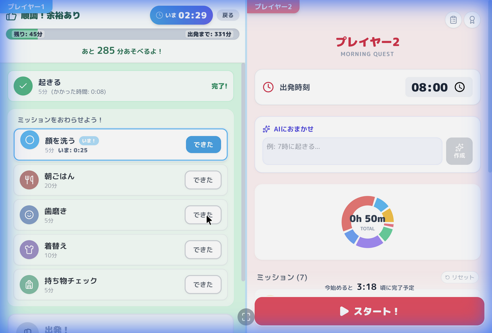
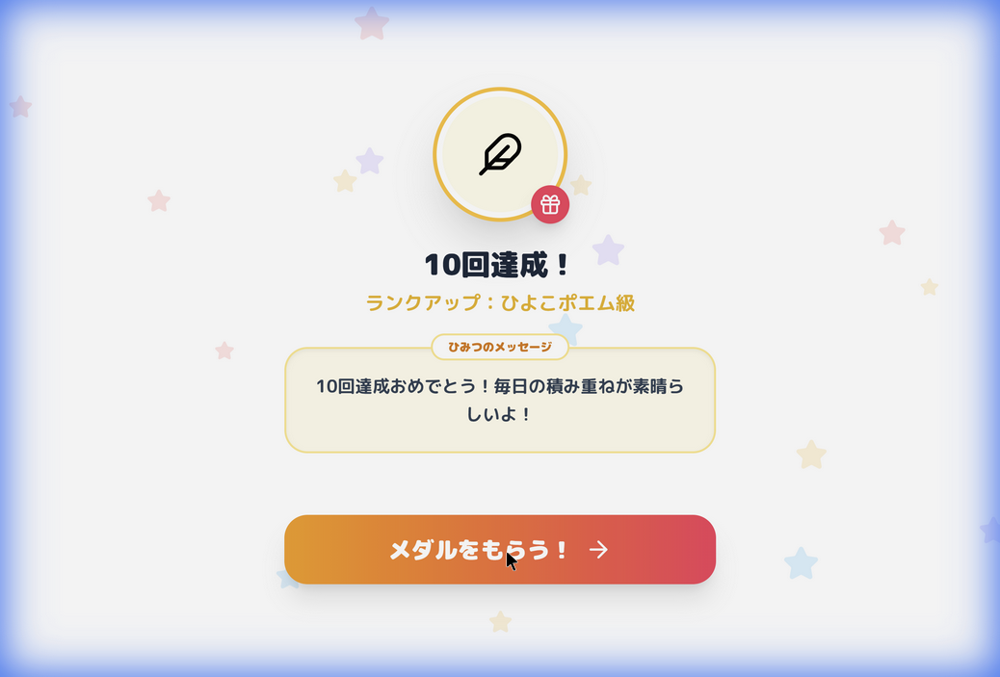

# MorningQuest: 経過時間表示機能のデモ

今回の修正で追加された、ミッションごとの経過時間表示機能を解説します。

## 主な変更点

### 1. 自動連鎖タイマー
- ミッション開始と同時に、最初のミッションのタイマーが自動で動き出します。
- 「できた！」ボタンを押すと、リストの次の未完了ミッションへ自動的にフォーカスとタイマーが移動します。

### 2. アクティブミッションの強調
- いま取り組むべきミッションが枠線やアニメーションで強調され、子供が迷わないようにしました。
- 予定時間を超えそうな場合は、数字が赤くなって「いそごう！」という合図を送ります。

### 3. 正確なきろく
- これまでは予定時間の合計を記録していましたが、今回計測した「実際の時間」をログに保存するようにしました。

## 動作確認の結果

| 項目 | ステータス | 詳細 |
| :--- | :--- | :--- |
| **起動** | ✅ 正常 | 「おきた！」から計測が開始されます。 |
| **自動遷移** | ✅ 正常 | 「できた」を押すと次のタスクが0秒から計測されます。 |
| **視覚効果** | ✅ 正常 | いま取り組んでいるタスクに「いま！」ラベルが表示されます。 |
| **ログ記録** | ✅ 正常 | 実際の経過時間が履歴グラフに反映されます。 |

### 実際の動作（録画）

### 自由な順番での完了（スクリーンショット）

## ごほうび機能のパワーアップ
10回スタンプが貯まると、自動的に「ごほうび画面」が表示され、ランクアップとメダル授与が行われます。

### 特徴
- **ランクアップ体験**: ひよこ → うさぎ → ライオン → 王様 とカードが進化。
- **コレクション図鑑**: 獲得したメダルとAIからの褒め言葉をいつでも読み返せます。
- **AI褒めメッセージ**: Geminiが10日間の実績を分析し、パーソナライズされた励ましを生成します。

### 動作確認（録画・画像）

## AIモデルの最新化
ご提示いただいた最新のドキュメントに基づき、アプリ全体で使用するAIモデルを最適化しました。

- **利用モデル**: `gemini-3-flash-preview`
- **効果**: より高度な推論と高速なレスポンスにより、スケジュールの提案や褒め言葉の生成がより知的で心のこもったものになります。

> [!NOTE]
> 経過時間は 1秒ごとに更新され、リアルタイムな感触を演出しています。

